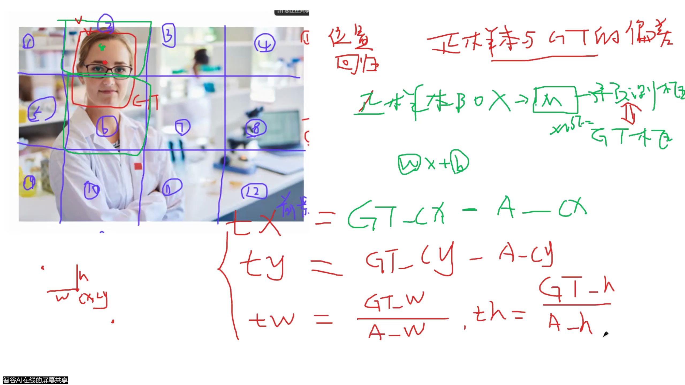
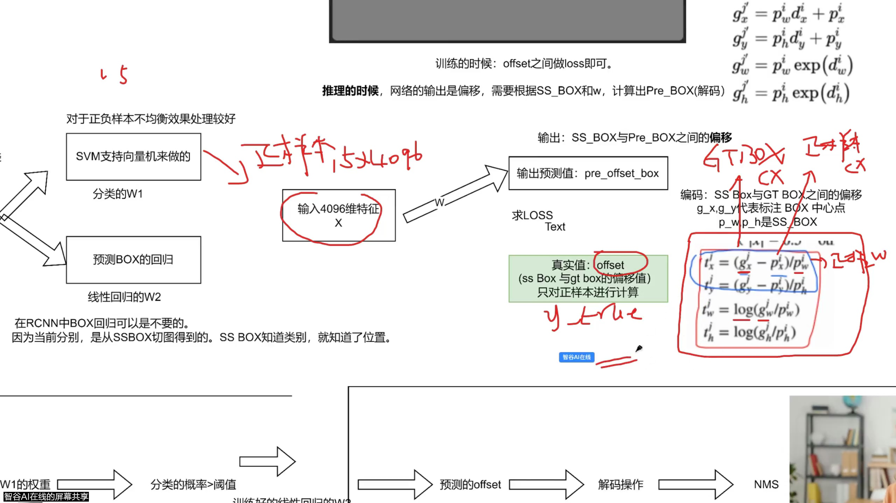
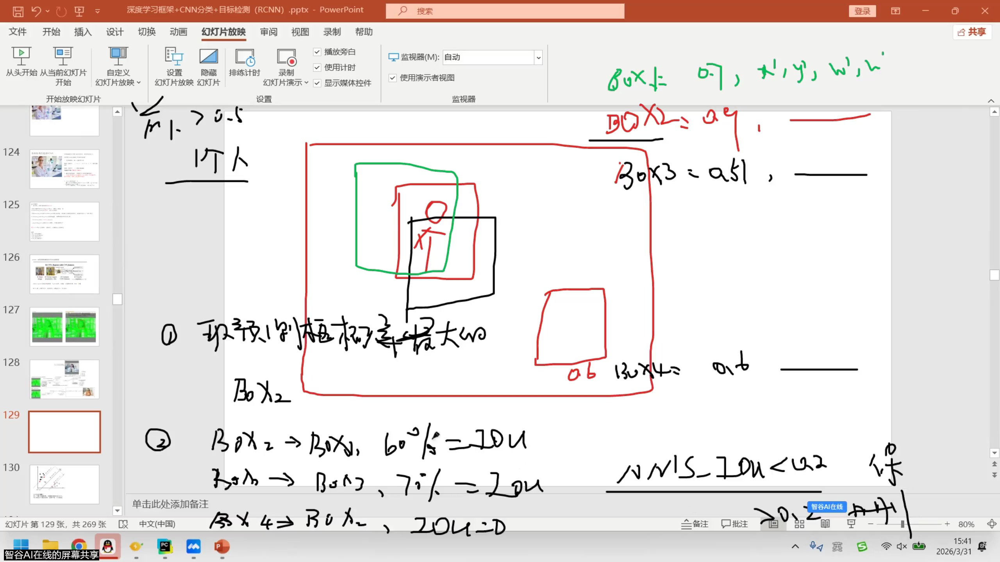
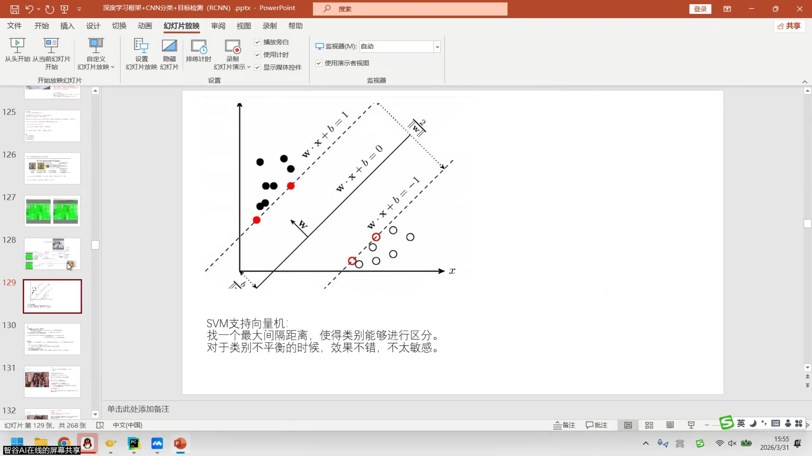

# 2026-03-31 · 目标检测1：把分类网络变成一个会找框的检测系统

> 对应视频：`2026_3_31目标检测1.mp4`，全长 **02:51:04**。这是YOLO阶段第1节，以R-CNN作为检测入门。本篇按视频顺序解释重要意群，合并重复问答和闲聊，不是逐字转录。
>
> 材料：本地视频、441张变化抽帧及28张总览、整段机器转写、3月31日课件。关键公式另与原始论文核对。文中的算例和少量代码是解释性补充，不冒充老师现场敲出的代码。时间均为 **时:分:秒**，段落范围用于回看定位，不表示每一秒都有新知识。

## 先把这节课的任务看清楚

你已经学过分类：输入一张图，网络回答“这是哪一类”。目标检测多了两个困难：**一张图可能有多个目标；每个目标不仅要报类别，还要报位置。**

这节课并不是上来给出一个巨大的YOLO网络让你背。老师尝试从“我已经有一个CNN分类器”出发，逐项补上缺失的功能：

```text
整张图
  → 提出一些值得检查的区域（候选框）
  → 每个区域提取视觉特征
  → 判断区域里是什么（分类）
  → 判断框应该怎样调整（回归）
  → 把调整量还原为图像上的框（解码）
  → 去掉对同一个目标的重复报告（NMS）
```

训练时还有一条“答案准备线”：

```text
人工标注GT + 候选框
  → 判断哪些候选框可以学习这个目标（匹配、正负样本分配）
  → 准备类别答案和框调整量答案
  → 与模型预测比较，计算loss
```

**这两条线要分开理解。** 推理时有图像、有候选框、有已经训练好的模型；没有这张新图的人工GT。视频后半段反复问“这个值到底从哪来”，大多是在这两条线之间混淆了。

### 时间导航

| 视频段 | 核心问题 | 本篇着重解释 |
|---|---|---|
| 00:00:00–00:09:02 | 为什么从老模型开始？ | 学习路线与工程选型的边界 |
| 00:09:02–00:30:30 | 分类怎样增加位置能力？ | GT、分类/回归、特征和监督 |
| 00:30:30–00:57:40 | 哪些区域算目标？ | 正负样本、IoU、匹配、样本失衡 |
| 00:57:40–01:35:54 | 怎样把不准的框修准？ | 特征输入、偏移标签、预测偏移，三者的区别 |
| 01:35:54–02:14:50 | 真正的R-CNN怎样组织？ | Selective Search、CNN、SVM、标准框编码 |
| 02:14:50–02:37:58 | 为什么会报出多个框？ | 分数过滤、NMS、误检和漏检 |
| 02:37:58–02:51:04 | 训练和推理如何闭合？ | 解码逆运算、全流程回顾及适用边界 |

---

## 1 · 学的是哪些共同问题，而不是版本号（00:00:00–00:09:02）

开场提到YOLO、Transformer检测器、CLIP和多模态模型，随后强调先讲R-CNN，再讲YOLO的演变。对当前学习最有价值的是这个顺序背后的理由：**先知道检测系统需要解决什么问题，后面才能看懂新模型究竟改了哪一步。**

例如，后面遇到一种“正样本选择算法”，你应该先想到：它是在决定哪个预测位置负责哪个GT，而不是凭空出现了一大段莫名其妙的张量代码。遇到“解码”，你应该先问：网络输出的是框本身，还是某种需要变换的表示？

老师还谈到老项目沿用YOLOv5、换更大模型未必获得更好效果。这一点可以落实为工程判断：一次换模型不仅改变网络，还可能改变输入处理、标签规则、训练策略、推理后处理和部署算子。新版本在公开数据上的成绩，不等于你的数据与设备上的最终效果。

但开场关于模型文件大小、行业占比、某些版本是否“值得学”等表达，是课堂经验口径，不能当成普遍统计或长期有效的定论。**真正可迁移的选型标准是：目标精度、漏检代价、推理时延、内存和部署条件。** 这里的“时延”就是处理一张图要花多久；它和模型参数量有关，但不是同一个量。

本课主要是二维目标检测的起点，没有展开视觉语言模型，也没有展开Transformer内部结构。听到名字能知道它们属于不同路线即可，不需要在这一节把所有分支补完。

## 2 · 从“有没有人脸”到“人脸在哪里”（00:09:02–00:12:30）

老师把一张有人脸的图片放上来，开始问：以前分类能告诉你有一个人脸，现在怎样把它框出来？

先分清**图像级答案**与**目标级答案**。图像级分类可以只输出“有人脸”；但如果有三张脸，这句话既没有告诉你数量，也没有告诉你每张脸的位置。目标检测的输出更像一张表：

| 目标 | 类别 | 左上角 | 右下角 | 预测时附带的分数 |
|---|---|---|---|---|
| 1 | 人脸 | `(28,41)` | `(88,51)` | 例如0.9 |
| 2 | 人脸 | 另一个位置 | 另一个位置 | 另一个分数 |

这里的位置数字只是说明输出格式，不是对课上那张脸的实测。类别回答“是什么”，坐标回答“在哪里”，分数表达模型对这个报告的确信程度或排序依据。分数和框是否贴合目标，不能混为一谈：模型可能很确信这是脸，但框仍然偏大。

本节先把类别限制为“脸/背景”，再处理位置，是为了减小入门复杂度。以后变成20类、80类时，位置问题并不会消失，只是分类答案更丰富。

## 3 · GT不是模型算出来的答案（00:12:30–00:14:30）

GT是 **Ground Truth**，在这里指人工标注的参考真值。对一张图，标注者指出目标类别，并给出包围它的矩形。训练程序加载这些标注，不需要让模型先猜出来再当答案。

矩形常用两种表示：

| 表示 | 四个数的意思 | 适合直观理解的动作 |
|---|---|---|
| `xyxy` | 左、上、右、下，即`x1,y1,x2,y2` | 在图像上画矩形 |
| `cxcywh` | 中心横坐标、中心纵坐标、宽、高 | 描述平移和缩放 |

二者是在说同一个框。例如`(30,40,70,60)`的宽是`70−30=40`，高是`60−40=20`，中心是`((30+70)/2,(40+60)/2)=(50,50)`。

后面把GT变成“偏移标签”，并不是重新标注，也不是GT坐标被模型改变了。只是**同一份真值，为了适配训练目标，换了一种数学表示**。就像温度从摄氏度换成华氏度，指向的对象没换。

坐标还要约定参考系：本篇默认以整张图左上角为原点，横轴向右、纵轴向下，单位是像素。不要把整图坐标、裁剪小图坐标、缩放后的坐标混在同一次减法里。

## 4 · 为什么检测至少有两种监督任务（00:14:30–00:17:36）

老师把问题拆成分类和位置回归。分类预测离散类别，回归预测连续数值。连续的意思是，框中心可以从50移动到50.1或50.2，而不是只能在两个类别中选一个。

因此可以先想象一个教学网络：同一份图像特征，一路输出“是不是脸”，另一路输出4个位置相关的数。训练时两路各有答案，也各有误差。常见的抽象写法是：

\[
L=L_{cls}+\lambda L_{box}
\]

`L`是总损失，`L_cls`是分类误差，`L_box`是框误差，`λ`是调节两者相对影响的系数。它不是“准确率相加”，而是把需要优化的两个目标组织在一起。

视频用MSE说明坐标误差。MSE是均方误差：预测减答案、平方、再求平均。它能帮助理解“数值偏离要受到惩罚”，但不代表所有检测器都用MSE。也不能据此认为原始R-CNN的各个模块就是这样一次联合训练的；本段首先是在建立多任务监督的概念。

分类损失同样不要背成“两个类别就只能BCE”。二分类有两种常见接口：

- 输出1个未经过sigmoid的数，配`BCEWithLogitsLoss`和0/1标签。
- 输出2个未经过softmax的数，配`CrossEntropyLoss`和类别索引0/1。

“未经过激活的分数”称为 **logit**。这两个PyTorch损失内部已经包含相应的数值稳定计算，所以不要机械地先做sigmoid/softmax再送入它们。BCE也能按类别独立用于多标签问题；它不是只能处理一个类别的函数。[BCE接口](https://docs.pytorch.org/docs/stable/generated/torch.nn.BCEWithLogitsLoss.html)、[CE接口](https://docs.pytorch.org/docs/stable/generated/torch.nn.CrossEntropyLoss.html)。

## 5 · “学到了空间信息”应该怎样理解（00:17:36–00:24:00）

老师提到检测骨干可以拿来做分类，并分享自己换骨干后效果变好的经验，推测与空间信息有关。这里值得理解的是**监督任务会影响特征学什么**，但不要把“空间信息”想成网络里一个专门存坐标的抽屉。

假设分类训练只要求认出猫。只看到猫耳朵，也可能足够答对；把猫的完整边界找准，不是这个答案的硬要求。检测训练则还要求框的位置、范围符合标注，相关误差会推动特征对目标结构和边界保持敏感。这解释了为什么不同训练任务可能得到不同的表征。

但分类CNN的中间特征图本身也有空间排列，不是完全没有位置信息。检测预训练的骨干在某个分类项目中更好，也可能与预训练数据、训练时长、网络结构和输入尺寸有关。**课堂经验可以成为实验假设，不能直接证明“提升来自空间信息”。**

“骨干”指主要负责提取特征的网络部分；“头”指将特征变成具体任务输出的部分。把检测骨干用于分类，通常是保留特征提取部分，再接分类所需的池化与分类层，不是把所有候选框和NMS一起搬过去。

## 6 · 输出4个数并不等于检测问题已经解决（00:24:00–00:30:30）

到这里容易产生一个错觉：最后加一个4维全连接层，不就会画框了吗？对“每张图恰好一个目标、只需要一个框”的简化任务，这可以作为一个方案。但一般检测不知道目标数量，一张图可能0个、1个或很多个。

固定输出一个框，首先就无法自然表达“这里有三个人”。于是本课选择另一种组织方式：**先准备多个可能的位置，让模型逐个检查，再把有效结果留下。**

这就是后面候选框的动机。不是因为神经网络不能输出坐标，而是需要组织一个数量可变、多位置、多目标的问题。

这段机器转写在约00:30:00附近出现无意义碎片。下文依据后续清晰文字和网格画面解释，不把这些碎片加工成老师的原话。课堂从整体分类转入分区域分类，正好是本课的第一个重要转折。

## 7 · 12个格子是思维模型，不是R-CNN的真实提框算法（00:30:30–00:34:00）

老师把图划成3行4列，一共12格，让你判断哪些格子包含人脸。画面中第2、第6格与目标有关，其余格子大多是背景。

此时可以把每格看成一个候选区域：从图里裁出这一块，再让分类器判断。原来“一张图做一次分类”，变成“多个区域分别做分类”。位置也因此有了一个粗略来源：你知道这块小图是从原图哪个矩形裁出来的。

但格子可能切开脸，也可能装入大量背景。这正是它只能当教学模型的原因。真实R-CNN用后面讲的Selective Search提出区域，不是固定12格；后面YOLO虽然也涉及网格，却不等于把每格单独裁出来跑一次分类CNN。

**本段保留的思想是“在多个空间位置提出判断”，不能把这里的具体实现直接套到所有检测器。**

## 8 · 正样本、负样本是候选区域的训练身份（00:34:00–00:37:00）

在当前“检测脸”的任务中，与脸对应的候选区域被选为正样本，明显不对应脸的候选区域是负样本。这个身份取决于训练规则和GT，不是模型一开始就知道的。

“负”也不表示图片坏了，更不表示不能用。负样本告诉分类器：这些纹理、衣服、墙面不应该被报告为脸。没有足够的负样本约束，模型可能见到一个近似轮廓就报目标。

背景是**相对于当前任务**说的。当前只标人脸，身体或椅子可能属于背景；换成人体或家具检测，标签就变了。工作中检查标注规则非常重要：未标注的真实目标如果被当成背景训练，会给模型相互矛盾的信号。

这里还要分清四个名词：

| 名称 | 来源 | 是不是预测结果 |
|---|---|---|
| GT框 | 人工标注 | 否 |
| 候选框 | 提区域的算法或约定 | 通常还不是最终检测框 |
| 正样本框 | 训练时从候选框中匹配出来 | 否，它是一种训练身份 |
| 预测框 | 模型输出经过相应解码得到 | 是 |

候选框变成正样本，并没有自动变得和GT一样准。**正样本只是获得了“负责学习这个目标”的资格。** 正因为还不准，才需要框回归。

## 9 · 为什么不能只数正负样本个数（00:37:00–00:41:23）

12格例子有2个正样本、10个负样本。老师提出给每个正样本配约3个负样本，即2正、6负，帮助解释样本平衡。

问题不只在于“10比2多”，还在于它们对梯度的总贡献。如果大量容易识别的背景持续参与求和，而少数目标样本被淹没，优化就可能偏向把背景答好。极端地，在绝大部分输入都是背景的数据上，始终回答背景也能有很高的表面准确率，却完全不会检测目标。

采样的做法是减少一部分负样本进入这一轮loss；加权的做法是调整不同样本贡献；难例挖掘是优先处理当前容易判断错的样本。它们都在改变**学习资源分配给谁**。

3:1是本课的说明性比例，不是目标检测通用定律。“正样本最多27个”“负样本必须比正样本多”“所有负样本绝不能都算loss”，都不能脱离具体模型和匹配规则背诵。按什么单位计数——每个GT、每张图、每层特征，还是一个batch——结论也不同。

看代码时真正有用的是顺着三件事查：哪些样本被选中、它们各乘了什么权重、最终除以什么数量。最后一项叫**归一化分母**，它直接影响loss和梯度的量级。

## 10 · 人能看出第2和第6格，程序靠什么判断（00:41:23–00:45:30）

人工看图知道这两格离脸近，但训练代码需要一个可以批量计算的规则。当前我们已经知道两类几何信息：候选框坐标、GT框坐标。于是可以计算它们的重叠程度。

IoU全称Intersection over Union，中文通常叫交并比：

\[
IoU(A,B)=\frac{A与B重叠的面积}{A面积+B面积-重叠面积}
\]

分母不是两框面积直接相加，因为重叠部分在相加时被算了两遍，要减掉一份。这也是“并集面积”的含义：两块区域合在一起，总共覆盖多大地方。

数值在0到1之间。完全重合是1，完全不相交是0。0不代表能衡量“离得多远”：两个只差1像素没碰到的框，与两个相隔半张图的框，都可能是0。

课上手画框的0.6、0.7一类估计，主要用于说明规则，不能当成按坐标计算的精确结果。真正代码里必须由坐标算面积。

## 11 · 用一个可核算的例子理解IoU（00:45:30–00:49:00）

以下是本篇统一使用的补充算例，后面还会用来编码和解码：

- 候选框P：`xyxy=(30,40,70,60)`，即中心`(50,50)`、宽40、高20。
- GT框G：`xyxy=(28,41,88,51)`，即中心`(58,46)`、宽60、高10。

重叠区域的左边取两个左边的较大者`max(30,28)=30`，右边取两个右边的较小者`min(70,88)=70`。上、下同理得到41和51，所以重叠宽40、高10、面积400。

P面积800，G面积600，并集`800+600−400=1000`，因此IoU是`400/1000=0.4`。

```python
def iou_xyxy(a, b):
    left = max(a[0], b[0])
    top = max(a[1], b[1])
    right = min(a[2], b[2])
    bottom = min(a[3], b[3])
    inter = max(0, right - left) * max(0, bottom - top)
    area_a = (a[2] - a[0]) * (a[3] - a[1])
    area_b = (b[2] - b[0]) * (b[3] - b[1])
    union = area_a + area_b - inter
    return inter / union if union > 0 else 0.0

print(iou_xyxy((30, 40, 70, 60), (28, 41, 88, 51)))  # 0.4
```

`max(0,...)`防止不相交时出现负的宽高。这个短函数假设输入框有效、坐标遵循连续边界约定，所以面积计算没有`+1`。不要在同一个项目里混用包含端点像素的旧整数约定和连续坐标约定。

## 12 · 阈值怎样把几何关系变成训练标签（00:49:00–00:53:00）

有了IoU，还需要决定多大才算正样本。这一步叫**分配或匹配**：把某个候选框分配给某个GT学习。

假设教学规则是IoU≥0.3算正，那么上述IoU=0.4的P可以负责G；如果阈值改成0.5，它就不满足这个条件。注意，图和框都没有变，变的是“让谁负责学习”的策略。

实际实现可能设置正、负两条阈值，中间作为忽略区；也可能为了保证每个GT有负责人增加特殊规则。因此“不是正样本”不总能直接推出“就是负样本”。

多目标图片还要回答：一个候选框与多个GT重叠时归谁？常见的教学实现取最大IoU的GT，再做阈值判断。这不是本视频完整展开的算法细节，但能解释你以后为什么会看到一个候选数×GT数的二维矩阵：每行是一个候选对所有GT的比较。

**阈值本身不属于网络权重，通常是程序中的策略参数。** 改它会改变训练样本，但不是让CNN通过反向传播直接学出这个数字。

## 13 · “先验框”“候选框”“正样本框”别混成一个词（00:53:00–00:57:40）

课堂为了衔接后续内容，会用“先验框”或anchor指代尚未修正的框。当前最稳妥的记法是：**它是回归所参照的一个已有框。**

但术语仍需保留边界：原始R-CNN的region proposal是图像算法提出的区域；后面一些检测器的anchor是预设形状与位置的参考框。二者都能作为回归参照，却不是同一种生成机制。

所以看一个变量叫`anchor`，要继续追问它怎么来的，不能只凭名字就认定是固定网格、固定长宽比或Selective Search。

本段课上用颜色帮助区分GT和候选，随后绿色圈出正样本。颜色随批注会变化，不需要背“绿色永远代表什么”。应当根据箭头判断：人工给的答案是哪一个，待修正的起点是哪一个。

## 14 · 第一种回归设想：只输入4个坐标够不够（00:57:40–01:07:00）

老师先提出一个中间方案：正样本框输入模型，输出GT框。画面上框坐标、模型和GT被箭头连起来，很容易让你以为模型只需要看到4个数。

这个设想最重要的价值是暴露问题。假设两张图上候选框都叫`(30,40,70,60)`：第一张脸偏右，第二张脸偏左。如果网络输入只有这4个相同的坐标，它凭什么给出两种不同修正？**缺少图像内容，它就没有区分这两种情况的信息。**

在很特殊的数据分布下，坐标模型可能拟合出某种固定偏差，但这不等于学会了根据目标外观定位。我们真正需要的是：从这个区域的视觉特征中判断，目标在区域内偏向哪里、范围大概多宽多高。

因此后面老师会把输入澄清为特征。读到这一段先不要把错误设想写进模板，等它如何被修正。这也是比单独截一句“正样本输入网络”更需要上下文的地方。

## 15 · 只给正样本算框回归误差，为什么（01:07:00–01:12:36）

分类时背景有明确答案“不是脸”。但是对一块纯墙面，你很难回答“这块墙面应该移动到哪张脸上”。在本课匹配方式下，它没有被分配到一个目标，自然没有对应的框回归答案。

因此这里的框回归只对匹配上的正样本计算；分类则使用选中的正、负样本。两路loss看到的样本数量可以不同，不是遗漏数据。

若用代码思维理解，就是先得到一个布尔掩码`positive_mask`：某一行是True，说明这行有框回归目标；False则跳过这一项。**掩码是参与计算的开关，不是把负样本的坐标目标粗暴设成零。** 后一种做法会要求背景框回归到原点，是另一种错误监督。

若某个batch没有正样本，还要处理空集合，避免对空张量求平均得到无效数值。本课没有现场实现该边界；以后读loss代码时，可以用这个问题理解为什么会有`if num_pos > 0`之类分支。

## 16 · 把“直接输出GT”换成“输出该怎样改”（01:12:36–01:19:49）

老师重新画图，把答案改写为位置与宽高的调整量。先采用一个直观版本：中心用差值，宽高用比值。

\[
t_x=G_x-P_x,\quad t_y=G_y-P_y,
\quad t_w=G_w/P_w,\quad t_h=G_h/P_h
\]

P代表候选框，G代表GT；下标x、y是中心坐标，下标w、h是宽和高。四个`t`是训练答案，不是网络刚刚预测出的数。

用本篇算例：

| 分量 | 计算 | 含义 |
|---|---|---|
| `tx` | `58−50=8` | 中心向右移8像素 |
| `ty` | `46−50=−4` | 中心向上移4像素 |
| `tw` | `60/40=1.5` | 宽扩大到1.5倍 |
| `th` | `10/20=0.5` | 高缩小到一半 |

因此答案是`(8,−4,1.5,0.5)`。这四个数不是同一种单位：前两项是像素，后两项是倍数。把它们全部叫“偏移”可以方便口述，但真正解码时不能全部直接相加。



画面上方“正样本BOX→模型→GT框”仍保留着早期设想，下方已经在定义新标签。**板书会累积，不代表同一屏上所有旧箭头都是最终方案。**

## 17 · 已经能算出偏移，为什么还要训练（01:19:49–01:25:30）

这是本课最值得单独讲透的疑问。因为训练时有GT，所以你可以算出“正确偏移”。但推理时GT不存在，你不能再做`GT−候选框`。网络的任务就是利用视觉特征，预测这个原本只有带答案时才能直接算出的量。

要把三个对象分别命名：

| 对象 | 怎样得到 | 在做什么 |
|---|---|---|
| 区域特征`features` | CNN读取候选区域图像 | 模型作答的依据 |
| 目标偏移`target_offsets` | GT和候选框按公式计算 | 标准答案 |
| 预测偏移`pred_offsets` | 回归模型读取特征 | 模型交出的答案 |

训练比较的是后两者。不能把“能直接算出target”误解成“预测已经解决”，就像分类标签已经写着猫，并不意味着新图片不需要分类器。

老师这里提到4096维特征，可以理解成：一个候选区域经过CNN后，变成4096个浮点数组成的描述。4096不是4096个框，也不是图像宽高，而是这一版特征向量的长度。两块区域就有两行，形状写作`(2,4096)`。

回归层将每行特征映射为4个数，输出`(2,4)`。第一维跟着区域数量走，第二维由任务定义决定。至于真实历史实现的回归特征是否正好用4096维，要与课堂示意区别，后文会集中说明。

## 18 · 预测偏移不是全连接层里的bias（01:25:30–01:30:00）

视频用`Wx+b`帮助理解线性映射，但里面的`b`不能直接等同于“框的偏移”。

在一个简化回归头中，输入特征向量`f`，输出4维预测`d=Wf+b`。W和b是所有样本共享的可训练参数；d则随每块图像特征改变，是当前样本的输出。

例如同一套W、b，看到靠左的人脸特征时输出向左修正，看到靠右的人脸特征时输出向右修正。如果只靠共享bias移动，每个框都会收到相同的固定调整，无法完成这样的区分。

同时，随机初始化参数只意味着训练刚开始时预测通常不可靠，不意味着同一输入每次前向都重新随机抽4个数。在排除Dropout等随机操作、固定运行条件的情况下，给定参数和输入，计算有确定结果。

你以后调试时看到一个奇怪的`pred_offsets`，应追踪输入特征、权重和激活范围，而不是用“它本来就是随机的”停止分析。

## 19 · loss变小，不等于偏移值都变成零（01:30:00–01:35:54）

本篇例子需要向右移8像素。网络从预测2改进到7.9，是学得更准；如果它一直朝0靠近，反而没有学会修正。

因此变小的是`预测偏移−目标偏移`的误差，而不是偏移本身。采用前面的直观编码，当候选框已与GT完全一样时，目标是`(0,0,1,1)`：中心不动、宽高乘1。它甚至不是4个零。

这还解释了“框差得远”和“回归loss大”不是严格等价。一个起点很偏的候选框，如果模型准确预测了需要的修正，编码空间里的loss仍可以很小。只是起点太差、区域里看不到足够目标信息时，学习往往更困难。

同一段中学生追问坐标原点。要保持P和G在同一整图坐标系；若改用了裁剪图坐标，就必须一起变换。中心点坐标和“以中心为原点的相对坐标”不是一回事：`Gx=58`是在整图里说中心的位置，`Gx−Px=8`才是在说两个中心的相对位移。

## 20 · 训练线重新连一遍，网络只是其中一部分（01:35:54–01:44:30）

现在可以按数据实际流动顺序重排课堂反复讨论的内容：

1. 读入图像和这张图的GT。
2. 提出候选区域，保留它们在整图中的坐标。
3. 用候选框与GT的关系分配正、负或忽略身份。
4. 按规则选取本轮参与学习的区域。
5. 从区域图像提取特征，计算分类输出和回归输出。
6. 用类别标签监督分类；用正样本对应的编码目标监督回归。
7. 计算误差并更新需要训练的参数。

这是一条理解数据依赖的教学线，不是声称原始R-CNN把所有模块放进一次反向传播。它的重点在于：**第3、4、6步的很多工作，是普通程序根据GT完成的，不是CNN自己“悟出来”的。**

这也回答了你以前“Dataset吐出数据以后，怎么一直到loss”的困惑的一部分。Dataset负责把图像和标注交出来；模型产生预测；中间还有尺寸/坐标处理、匹配、目标构造。它们放在Dataset、模型内部还是loss函数里，各仓库可以不同，但职责不能凭空消失。

看源码时，比起先背文件名，更有用的是给每个变量写一句“它是图像、标注、匹配结果、预测，还是误差”。这样就不会把几种名字相似的box看成同一个东西。

## 21 · 后续算法究竟可以改哪里（01:44:30–01:50:00）

老师列举正样本选取、正负比例、候选框和偏移定义等改进空间。现在这些名字已经有具体位置：

| 想改善的现象 | 可以检查的环节 | 改变的是哪种行为 |
|---|---|---|
| 目标根本没被合适候选覆盖 | 候选生成 | 有没有合适的起点 |
| 有候选但没有分到目标 | 匹配规则 | 谁负责学习这个GT |
| 背景影响太强 | 采样、加权、loss归一化 | 梯度更重视谁 |
| 小目标与大目标的回归难度差很大 | 编码和loss | 数值目标怎样表示、怎样比较 |
| 目标看不清、辨不出 | 特征提取与输入质量 | 模型是否有足够判断依据 |

这些是定位问题的方向，不表示看到某种现象就能唯一确定原因。例如漏检也可能源于后处理阈值过严，而非一定是候选生成不好。

老师口中的“两阶段”也要分清：检测架构中的两阶段，通常强调先有候选区域，再对区域识别和精修。**不是因为一个程序有训练和推理，就叫两阶段检测；也不是因为有分类和回归两个输出头。**

## 22 · Selective Search替换了手画12格（01:50:00–01:54:30）

这里开始介绍真实R-CNN流程。Selective Search，常缩写SS，中文通常叫选择性搜索。它利用图像中的颜色、纹理、区域大小和邻接关系等线索，组合出一批可能包含物体的区域。

先把它理解成**给后续分类器提供检查清单**，不是已经识别出目标。它不知道你的最终类别答案，也不保证每个区域都对应一个真实物体，所以会提出大量背景框和相互重叠的框。

课件中约2000个候选是本课沿用的常见数量级，不是每张图天然恰好有2000个目标。画面中更多原始候选再截取部分的说明，也不要直接固化成你以后所有实现中的常数。

区域数量带来一个立即可见的成本：如果每块裁剪区域都重新经过一次CNN，很多重叠像素会被重复计算。**区域越多，可能覆盖得越充分，也可能越慢。** 这正是后续理解共享整图特征方案时的重要背景。

## 23 · CNN提特征、分类器判类别、回归器修框（01:54:30–02:00:30）

课堂大图将三个功能分开：区域图像进入CNN得到特征；特征进入分类器判断类别；正样本特征进入回归器学习如何修框。

如果有2000个区域，示意特征矩阵可以写为`(2000,4096)`。每行是一块区域的描述，行号必须能追溯到对应候选坐标。**只保存特征却丢了坐标对应关系，后面就不知道该把哪组偏移应用到哪个框。**

老师提到SVM（支持向量机）分类器。你此处不需要重新学完整SVM优化，只需理解它也是“输入特征、输出类别相关分数”的分类模型，和CNN特征提取可以分工。多类别的一对其余策略，是为某个类别训练“属于它/不属于它”的判别器，再对多个类别分别评分。

但SVM分数不是天然处于0到1之间的概率。课上后续用0.9、0.7举例，是为了说明按分数筛选与排序；如果接口实际来自SVM决策函数，不能直接把0.9解释成90%的概率。

### 这里与原始论文的边界

原始R-CNN的R指Regions。论文包含检测任务微调，并非始终冻结预训练CNN；后续另训SVM与框回归。其框回归使用pool5特征及带正则的最小二乘，不是课堂图里统一4096维的简写。CNN微调与SVM训练的正负样本定义也不同，不能把一组IoU阈值通用于所有阶段。[原始R-CNN论文，§2.3及附录B/C](https://arxiv.org/html/1311.2524)。

因此本文借课堂图理解接口，但不把它当论文逐行复现说明。“SVM对不平衡天然不敏感”也不宜绝对化，训练样本选择和权重仍会影响分类边界。

## 24 · 60行、15行、4096列分别在数什么（02:00:30–02:02:44）

课上用15个正样本，按1:3取45个负样本，解释分类器输入。于是分类使用`15+45=60`行区域特征，回归只使用其中15行正样本特征。

| 数量 | 数的对象 |
|---|---|
| 2000左右 | 最初提出的候选区域 |
| 15 | 本例筛出的正样本区域 |
| 45 | 按比例选入的负样本区域 |
| 60 | 本轮分类训练用的区域总数 |
| 4096 | 课堂示意的每个区域的特征长度 |
| 4 | 每个区域回归输出的分量数 |

转写中正负候选的总数口算有不闭合之处：如果总数恰好2000、正样本15，且其余全是负样本，那么剩余应是1985，不是1885。如果还有忽略样本，才需另列。不要把口算数字直接写进程序。

“一个batch有60个区域”与“一个batch有60张原始图片”也不是同一件事。区域可能来自少量原图。以后调试维度时，应在`N`旁边写出它数的是图、区域、目标还是候选位置，单写“batch维”容易误导。

## 25 · 为什么中心偏移还要除以框宽高（02:02:44–02:06:30）

正式公式把最初的像素差值改成相对尺度：

\[
t_x=\frac{G_x-P_x}{P_w},\qquad
t_y=\frac{G_y-P_y}{P_h}
\]

同样向右移8像素，对宽40的框是移动自身宽度的20%；对宽400的框只是2%。直接使用8，无法表达这两个修正相对于目标尺寸的差异。除以参考框宽度后，目标分别成为0.2和0.02。

反过来，两个不同大小的目标都需要移动自身宽度的20%，经过这种表示就能得到相同的`tx=0.2`。这让“相似的相对修正”在训练目标上更一致。

这里“归一化”的意思是去掉像素尺度影响，**不是Batch Normalization，也不是强制把结果压到0到1**。如果目标中心差了两倍框宽，结果就是2；向左则可以是负数。

本篇算例中，`tx=8/40=0.2`，`ty=−4/20=−0.2`。两个绝对位移不同，却都是沿各自方向移动参考尺寸的20%。

## 26 · 宽高比为什么取log（02:06:30–02:10:00）

正式宽高编码是：

\[
t_w=\log(G_w/P_w),\qquad t_h=\log(G_h/P_h)
\]

log在这里是自然对数，逆运算是指数`exp`。它让乘法缩放变成可以用正负数表示的加法尺度：扩大2倍得到`log(2)`，缩小到一半得到`log(0.5)=−log(2)`。相反方向、同等倍率的变化，在数轴上相对零对称。

宽度不变时，比值是1，`log(1)=0`。因此采用这套正式编码，完全无需修改的框目标才是`(0,0,0,0)`。这与前面不取log的`(0,0,1,1)`不同，不能换了编码却沿用旧解释。

本篇算例完整目标变为：

```text
tx = (58−50)/40 = 0.2
ty = (46−50)/20 = −0.2
tw = log(60/40) ≈ 0.405465
th = log(10/20) ≈ −0.693147
```

取log需要宽高为正。如果输入框宽是0，首先应检查标注或前处理产生的退化框，不能把这个问题解释为“模型还没训练好”。



读这张图先从右下绿色答案框开始：它由SS框和GT框计算。再看左侧特征进回归器，产生预测offset。**loss连接的是两组offset，而不是拿4096维特征与4维坐标直接做差。**

## 27 · 这套表示怎样进入实际loss（02:10:00–02:14:50）

在一个教学版本中，N个正样本有`(N,4)`的目标偏移，也有同形状的预测偏移。你可以逐分量比较误差，再按约定求和或平均。

看懂一个loss至少要问四件事：输入表示是否相同、行与行是否对应、哪些行参与、最后怎样聚合。只知道“用MSE”是不够的。如果第1行预测属于P1，却拿P2对应的答案监督，维度完全对得上，训练却在学错关系。

还有一个容易混淆的层次：原始GT坐标是数据；目标偏移是由数据计算的监督；网络参数是被优化的变量。通常不能为了让loss变小而让GT或目标偏移跟着预测一起移动，否则就相当于考生改标准答案。

课堂图把它抽象成线性回归，是为了表达“特征到连续数值”的映射。不要因此以为所有现代检测回归头只有一层，也不要以为最终输出一定都用这四个offset。以后学习YOLOv8的距离分布时，会换表示，但“构造目标→预测→比较→解码”的问题仍然存在。

## 28 · 推理时，正样本标签不再从GT里来（02:14:50–02:20:00）

推理是拿训练好的参数处理新图。你还可以提出候选区域、提取特征、给出类别分数和框调整量，但不能执行“与新图GT比较来选正样本”，因为实际使用时没有这个答案。

老师有时仍把待解码的框口头叫“正样本”。这里应理解为被模型认为可能有目标的候选，而不是已经通过真值验证的训练正样本。

有了这个区分，流程就不神秘了：原来监督target来自GT，现在target这条线消失；模型已经学到的W、b继续根据输入特征算出预测offset。然后程序用候选框作为参照，把offset还原成坐标。

评测数据可以有GT，但它用于事后比较预测好坏，而不是帮助检测器决定该输出哪个框。**评测有答案，不等于推理算法可以偷用答案。**

## 29 · 分数阈值是在过滤什么（02:20:00–02:25:30）

假设模型检查2000个候选，为每个候选给出“像不像脸”的分数。如果所有框都画出来，背景区域也会把图片淹没。所以先设一个分数阈值，只保留足够有把握的报告。

这里的0.5一类数值是例子，不是通用最佳值。阈值提高，通常会去掉更多低分候选，既可能减少误检，也可能丢掉困难目标；阈值降低则相反。具体效果必须看数据。

“没有框”“一个框”“多个框”不能脱离真实图像判断好坏：无目标图片不输出框是正确行为；多人图片输出多个框也是需要的。课上先假设图中只有一张脸，是为了让你看清重复检测问题。

分类分数与IoU还不是同一维度。分数说模型有多确信类别，IoU说两个矩形重叠多少。高分框可以位置差，低分框也可能碰巧和GT很贴合。后处理经常同时用这两个量，正因它们解决不同问题。

## 30 · 只保留最高分，为什么会漏掉另一个人（02:25:30–02:30:00）

如果你先验确信整图最多一个目标，选最高分可能是一个简化策略。但通用检测不能提前知道只有一个人。

想象左边一张脸被重复报了3个框，右边另一张脸被报了1个框。全部只留最高分，就可能把右边真实的人删掉。我们需要的操作更细：**同一个目标附近的重复报告互相竞争，不同位置的目标可以同时保留。**

这就是NMS（Non-Maximum Suppression，非极大值抑制）的动机。它不直接看“这究竟是不是同一个人”的语义，而是用重叠程度作为重复的近似判断。

因此它是一种后处理启发式。目标非常拥挤、两个真实物体框高度重叠时，也可能误删。这一点说明NMS阈值不是越低越好。

## 31 · 跟着四个框完整走一次NMS（02:30:00–02:32:59）

课堂四个框的分数为：Box1约0.7、Box2约0.9、Box3约0.51、Box4约0.6。最高分是Box2。手画示意给出它与Box1、Box3重叠较多，和Box4不重叠；0.6、0.7的IoU是课堂目测示例。

步骤不是“取一次最高分就结束”，而是迭代：

1. 从剩余框中取最高分Box2，放进保留结果。
2. 计算其余框与Box2的IoU。
3. 删除重叠超过NMS阈值的低分框；当前例中删除Box1、Box3。
4. 在还没处理的框里继续取最高分。剩下Box4，所以它也保留。

最终是Box2和Box4，而不是整张图只剩一个框。



课上先有人把方向答反，随后纠正为“低重叠保留，高重叠去掉”。记忆时应该联系目的：我们在去重复，所以越重叠越需要竞争；不是重叠越低越应该删。边界是否包含等号要看实现，Torchvision的接口抑制的是IoU**大于**阈值的较低分框。[NMS官方接口](https://docs.pytorch.org/vision/stable/generated/torchvision.ops.nms.html)。

## 32 · NMS阈值和训练IoU阈值，方向为何看起来相反（02:32:59–02:35:43）

训练匹配时，希望找到与GT足够相关的候选，所以IoU大通常是获得正样本身份的条件。NMS时，希望去掉高度重复的预测，所以IoU大反而可能使较低分框被删除。

这不是IoU定义变了，而是**比较对象和处理目的不同**：

| 出现场景 | 哪两个东西在比较 | 大IoU的含义 |
|---|---|---|
| 训练匹配 | 候选框与GT | 可能适合负责该目标 |
| NMS | 预测框与另一个预测框 | 可能是重复报告 |
| 检测评测 | 预测框与GT | 可能定位达标，还要考虑类别及匹配规则 |

同样，分数阈值提高和NMS阈值提高，不能都理解成“更严格”：分数阈值提高通常保留更少框；固定输入候选时，提高NMS的IoU阈值通常会减少抑制，保留更多重叠框。

本节以单类别讲解，多类别时还要决定是否分类别执行。否则两个不同类别的高度重叠框，也可能互相抑制。后面的多类别NMS课程会继续展开，现在先把单类别的一轮轮筛选学清楚。

## 33 · NMS无法替你消灭所有误检（02:35:43–02:37:58）

如果Box4框住的是空地，却分数较高，而且不与其他框重叠，NMS会保留它。因为它不知道图像中那里到底有没有人，它只知道分数与坐标。

这叫误检：没有该目标的位置被报告出目标。相反，真实有人却没有有效框覆盖，是漏检。重复报同一个人又是另一类问题；评价时通常不能把多个重复框都当成多个正确目标。

排查时可以沿步骤定位：

- NMS之前就没有任何候选能覆盖目标，先看模型预测、输入质量和候选生成。
- NMS之前有合适框，但分数过滤后没了，检查阈值和分类质量。
- 分数过滤后还在，NMS之后消失，检查它被哪个框抑制、类别处理是否正确。

这比看到“漏检”就立刻加大模型，更有明确的诊断方向。本节没有实际做这个实验，但流程已经提供了你将来该打印哪些中间结果的依据。

## 34 · 解码必须与编码成对，不是四个数全部相加（02:37:58–02:41:31）

老师回到前面的公式，强调预测偏移与参照框共同得到预测框。口头简写成“偏移加框”，应当理解为**应用修正**，不能照字面让4个分量全相加。

正式编码的逆变换是：

\[
\hat G_x=P_x+P_w d_x,\quad
\hat G_y=P_y+P_h d_y
\]
\[
\hat G_w=P_w\exp(d_w),\quad
\hat G_h=P_h\exp(d_h)
\]

`d`是网络预测的4个数，带帽子的G是预测结果，不是真值。前两项编码除过宽高，所以解码乘回来；后两项编码取过log，所以解码做exp，再乘原宽高。

假设网络这次预测恰好等于本篇目标`(0.2,−0.2,0.405465,−0.693147)`，就得到：

```text
中心x = 50 + 40×0.2 = 58
中心y = 50 + 20×(−0.2) = 46
宽 = 40×exp(log(1.5)) = 60
高 = 20×exp(log(0.5)) = 10
```

再由中心宽高变回边界，左边`58−60/2=28`、上边`46−10/2=41`、右边88、下边51，正好还原到GT。这个例子把前面所有对象闭合了：候选框没变，答案编码已知，网络若学对偏移，解码就能得到对的框。

```python
from math import log, exp

def encode(p, g):  # 两者均为(cx, cy, w, h)，且宽高为正
    return ((g[0] - p[0]) / p[2],
            (g[1] - p[1]) / p[3],
            log(g[2] / p[2]), log(g[3] / p[3]))

def decode(p, d):
    return (p[0] + p[2] * d[0],
            p[1] + p[3] * d[1],
            p[2] * exp(d[2]), p[3] * exp(d[3]))

p, g = (50, 50, 40, 20), (58, 46, 60, 10)
print(tuple(round(v, 6) for v in encode(p, g)))
# (0.2, -0.2, 0.405465, -0.693147)
print(decode(p, encode(p, g)))  # (58.0, 46.0, 60.0, 10.0)
```

这段代码只验证几何变换可逆，不代表训练了一个检测器。训练的难点是让模型在没见到G时，靠图像特征预测出合适的d。

## 35 · 最后一次问答：到底在比较哪两个值（02:41:31–02:46:08）

这一段学生反复确认训练、推理、GT和offset的关系。把它整理成四行，比记住当场不断变化的字母更有效：

```text
target = encode(候选框, GT框)       # 只有带标注时能计算
prediction = 回归模型(区域特征)    # 训练和推理都能计算
loss = 比较(prediction, target)    # 监督训练使用
box = decode(候选框, prediction)  # 得到可画在图上的预测框
```

第一行和第四行都要候选框，但用途相反：第一行用它描述“答案相对于起点怎么改”，第四行用它把模型的修正落回实际位置。

如果把第一行直接带进真实推理，会缺GT；如果把第三行的target当作模型输出，你其实绕过了学习；如果第四行直接拿prediction当`xyxy`画图，坐标就会严重不对。

课堂说编码关联训练、解码关联推理，是当前流程的主要用途。**不要扩大为“训练绝对不会解码”**：有些训练损失或可视化也会先解码预测框。判断依据是具体计算需要什么表示，而不是阶段名称禁用了哪种运算。

本段约02:41:34附近机器识别出现重复字符。没有把这段乱码恢复成杜撰引语；公式以画面和上下文为依据，转写原稿保留供追查。

## 36 · 收尾的SVM画面与学习建议（02:46:08–02:51:04）

收尾屏幕短暂显示SVM示意图，但口述主要在强调把训练和推理分开梳理，并分享自己曾经听不懂后续检测课程的经历。因此不能因为屏幕上有公式，就把这一段写成老师完整推导了SVM。

补充理解这张图只需一句展开：黑白两类点是不同类别的特征样本；中间的分界线尝试把它们分开，两边的平行线表达间隔。**这是特征空间的分类边界，不是原图上要画出的目标框边界。** 它不会直接替代框回归。



最后的学习建议是从R-CNN起源建立检测的共同问题，再看后续算法怎样改进。这对当前阶段是合适的，但不需要重新完整训练一个历史R-CNN才能继续YOLO。你更需要能顺着图说清：谁给候选、谁给答案、网络看到什么、预测怎样变成最终框。

---

## 整节课收束：一张表说明变量的生命周期

| 变量 | 训练时来源 | 推理时来源 | 是否需要网络学习 |
|---|---|---|---|
| 图像 | 数据集 | 新输入 | 否，它是输入 |
| GT类别/框 | 标注 | 实际使用时没有 | 否 |
| 候选框 | 提区域算法 | 提区域算法 | 本课SS不通过检测loss学习 |
| 区域视觉特征 | CNN | CNN | CNN参数可以训练，具体阶段另定 |
| 正负样本身份 | GT匹配规则 | 没有真值身份；只能根据预测筛选 | 匹配本身通常是程序规则 |
| 类别分数 | 分类器 | 分类器 | 是 |
| 目标offset | GT与候选编码 | 不可直接获得 | 否，它是监督答案 |
| 预测offset | 回归器 | 回归器 | 是 |
| 预测框 | 候选与预测offset解码 | 同左 | 解码公式本身不需要学习 |
| 最终保留框 | 后处理；可用于验证 | 分数过滤、解码、NMS等 | 本课NMS不通过梯度训练 |

### 读完应当形成的理解

检测的复杂，不仅来自网络层数多，还来自一张图要组织很多位置、数量不固定的目标和不同类型的监督。候选框把搜索空间组织起来，匹配把答案分配下去，回归把粗位置修准，解码把数值表示翻译回图像坐标，NMS处理重复报告。

本课真正的难点是**目标偏移与预测偏移**。它们形状相同、名字相似，却分别是标准答案和模型作答。只要把来源分开，就不会再问“GT都算出来了，为什么还要网络”，也不会在推理阶段找不到所谓正样本。

### 本节讲到了什么，没讲到什么

| 内容 | 本课实际覆盖程度 |
|---|---|
| 检测训练/推理主线 | 反复完整串讲，是核心 |
| 候选、正负样本、IoU、偏移、NMS | 有板书与问答，本篇重点展开 |
| 框编码/解码公式 | 有简化版到正式版的变化，已区分 |
| R-CNN历史实现细节 | 课堂有简化，不能直接当复现规格 |
| Dataset/DataLoader具体类 | 没有逐行源码讲解 |
| 完整训练循环、优化器、保存模型 | 没有完整实现 |
| 多类别NMS、YOLO输出张量、DFL | 留给后续课程，不在这里假装讲过 |

所以，若你期待本节给出一份能直接开训的代码，课程本身没有做到；这不是从精讲中删掉了大段IDE代码。本课更像是在为后面的源码建立词义和数据关系。

## 转写与材料核对记录

### 重要术语纠正

| 机器转写常见写法 | 本文使用 | 依据 |
|---|---|---|
| 阿森、RCN、阿斯人 | R-CNN | 课件标题与流程图 |
| 正样本/镇样本混写 | 正样本 | 与GT匹配的上下文 |
| 偏硬直、便宜值 | 偏移值/offset | 板书公式 |
| IAU、交病比 | IoU、交并比 | 交并比公式 |
| MMS、MS | NMS | 后处理板书 |
| 物件、漏简 | 误检、漏检 | 无人却有框/有人却无框的问答 |

本文不提供一个伪称“100%准确”的转写版本。原始机器稿保留；乱码、口头重复以及局部不清楚的问答没有被改写成带引号的原话。解释基于可核对的知识段、画面和公式。

### 源文件与复查入口

- 视频：`/Users/apple/Documents/36/36期课程视频/2026_3_31目标检测1.mp4`
- 完整抽帧：`/Users/apple/Documents/36/36视频抽帧/2026_3_31目标检测1/`
- 总览：上述目录的`_总览/`；441张是变化检测保留量，不等于只检查了441个时刻，也不保证所有细微变化都被捕获。
- 原稿：`/Users/apple/Documents/36/36视频语音转文字/YOLO阶段/2026_3_31目标检测1_机器转写原稿.txt`
- 分段识别记录：同目录`2026_3_31目标检测1_分段原始数据/`。
- 定点重识别：同目录`2026_3_31目标检测1_复核片段/`。它是第二次机器识别记录，不自动等于人工校准。
- 本课资料：`/Users/apple/Documents/36/AI36期上课资料和文件/2026-03-31/`，包含PPT和4张PNG。该PPT是累积课件，后面的幻灯片不能据此认定本视频都讲过。
- QQ补充资料中亦有相关PPT版本；本文优先采用按日期目录的课件与视频当场画面，未把其它日期材料拼成课堂原话。

本文仅复制4张关键教学截图到相对路径`assets/2026_3_31/`，让这几张随Obsidian笔记同步；全部抽帧和视频仍留在库外。

### 评价与阅读建议

这节最有帮助的地方，是拿同一张图反复追问“程序怎么知道”“答案从哪来”，把训练目标构造摆到了台面上。容易让人困惑的地方，是先写中间方案、后修正输入与标签，又在推理时继续口称正样本；术语和历史实现也有简化。

因此本篇保留了推理的来龙去脉，并把“最初设想”和“最终可用关系”分开。如果今天只吸收知识，优先读第14–19节以及第34–35节，把一个候选框如何得到target、prediction和最终坐标贯通，不额外安排答题或练习任务。

返回：[YOLO阶段制作进度与阅读入口](00_制作进度与阅读入口.md)
